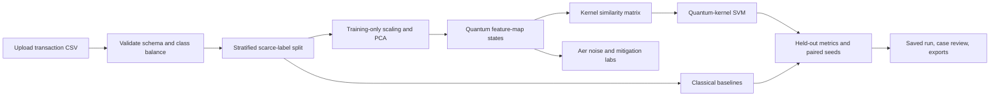

<div align="center">

# Q-Fraud Intelligence

### A quantum-kernel research lab for fraud detection when confirmed labels are scarce

**We don't assume quantum advantage. We measure it.**

[](https://qkernel.vercel.app)
[](https://qkernel-api.onrender.com/docs)
[](https://github.com/S-Chiranjeevi/QKernel/tree/main/frontend)
[](https://quantum.cloud.ibm.com/docs)

[Try the dashboard](https://qkernel.vercel.app) · [Open API docs](https://qkernel-api.onrender.com/docs) · [Report an issue](https://github.com/S-Chiranjeevi/QKernel/issues)

</div>

---

## The question

Fraud is rare, confirmed examples can be scarce, and accuracy can hide missed fraud. **Can a quantum feature-space kernel help a classifier separate fraud from legitimate transactions when only a few fraud labels are available?**

Q-Fraud Intelligence is a browser-based research prototype for testing that question with controlled splits, multiple classical baselines, repeated seeds, and transparent caveats. It also lets you inspect the feature map, explore simulated noise, and review saved predictions.

> **Research prototype:** quantum circuits run in local software simulation. This project does not connect to a quantum processor, does not claim quantum advantage, and is not a production payment decision system.

## At a glance

| | |
|---|---|
| **Research focus** | Classical fraud models vs. an ideal Qiskit quantum-kernel SVM under scarce labels |
| **Primary metric** | PR-AUC / average precision, with recall, precision, F1, ROC-AUC, and accuracy |
| **Quantum execution** | Exact Qiskit statevector kernels and Qiskit Aer noise simulation |
| **Web app** | React + TypeScript + Vite on Vercel |
| **API worker** | Python + FastAPI + scikit-learn + Qiskit on Render |
| **Saved evidence** | Configuration, seeds, data hash, metrics, predictions, and kernel artifacts |

## What the current benchmark says

The repository contains four saved ideal benchmark runs on the ULB/Worldline credit-card dataset. Each run uses ten deterministic seeds and a balanced held-out evaluation subset. The CV-selected classical model had higher mean PR-AUC at every tested fraud-label budget:

| Fraud labels used for training | Quantum ideal PR-AUC | Best classical PR-AUC | Saved verdict |
|---:|---:|---:|---|
| 6 | 0.67 | 0.89 | Classical preferred |
| 10 | 0.83 | 0.91 | Classical preferred |
| 20 | 0.85 | 0.93 | Classical preferred |
| 50 | 0.88 | 0.93 | Classical preferred |

These values describe the saved experiment and its data protocol; they are not a promise of performance on live transactions. The current saved evidence is for **ideal** kernels. The Noise and Mitigation labs are separate, small-sample protocols and should not be treated as paired results from the same test set.

## How it works



### 1. Prepare the data

Upload a CSV containing numeric `V1`–`V28`, `Time`, `Amount`, and binary `Class` columns. The Dataset workspace checks required fields, numeric values, missing or non-finite values, class labels, row counts, duplicates, and class balance. A SHA-256 fingerprint records which dataset a run used.

The model uses `V1`–`V28` and `Amount` as its 29 input features. `Time` is validated and shown in dataset context, but is not included in the classifier feature list.

### 2. Create a scarce-label benchmark

For each seed, the ideal protocol holds out 400 legitimate and 100 fraud transactions. From the remaining data, it samples 200 legitimate rows and `k` fraud rows for training, where `k` is 6, 10, 20, or 50. The benchmark defaults to ten deterministic seeds.

Standard scaling, PCA, angle mapping, model selection, and decision thresholds are fit on training data only. The held-out set is evaluated once. Its balanced class ratio makes a small comparison measurable, but differs from natural fraud prevalence.

### 3. Compare quantum and classical models

PCA reduces the 29 model features to the selected number of components (4, 6, or 8). The components are mapped to angles in `[0, π]`. Qiskit builds a feature map using Hadamard, RZ, and optional pairwise RZZ gates. The similarity between two transactions is:

```text
K(x, y) = |<φ(x) | φ(y)>|²
```

The resulting precomputed kernel matrix is supplied to a classical SVM. Baselines include RBF-SVM, logistic regression, random forest, and an all-features classical RBF-SVM. Model parameters are selected using training-only cross-validation.

### 4. Study noise and mitigation

Noise Lab uses Qiskit Aer with configurable single-qubit, two-qubit, and readout errors. Its **quick protocol** takes 15 fraud and 15 legitimate examples per seed, then uses a 20-row training set and a 10-row test set. The quick shot sweep compares 128, 256, and 512 shots; individual runs can use higher shot counts.

Mitigation Lab folds circuits at noise scales 1, 3, and 5; extrapolates with linear, Richardson, and exponential methods; then repairs the training kernel by symmetrizing and projecting it to positive semidefinite form. Mitigation adds simulation cost and may not improve a run.

## Explore the labs

| Workspace | What you can do |
|---|---|
| **Overview** | Review the research question, saved evidence, and benchmark coverage. |
| **Dataset** | Upload and validate a CSV; inspect rows, class balance, duplicates, and provenance. |
| **Quantum Lab** | Configure the feature map, inspect circuit structure, and compare two feature vectors with an exact statevector kernel. |
| **Benchmark** | Run ideal quantum/classical comparisons, review metrics and paired seed evidence, and launch entanglement or feature-map scaling ablations. |
| **Noise Lab** | Compare ideal and finite-shot noisy kernels under LOW, MEDIUM, or HIGH error presets. |
| **Mitigation Lab** | Inspect noise-scale extrapolation, kernel repair, and before/after metrics. |
| **Fraud Case Lab** | Review held-out transactions, model disagreements, and fraud cases each model catches or misses. |
| **Saved Runs** | Compare, replay, and inspect runs; view kernel heatmaps; export JSON, CSV, or Markdown. |
| **Methodology / Resources / Limitations** | Read experiment rules, source links, metric definitions, and interpretation limits. |

Additional workflow features include pre-run runtime estimates, background job progress and cancellation, a rule-based experiment planner, a staged judge demo, a bounded SHA-256-keyed kernel cache, run provenance, and a threshold policy sandbox. The sandbox changes the displayed decision policy; it does not retrain a model or establish a production threshold.

## Technology and architecture

| Layer | Tools | Responsibility |
|---|---|---|
| Web UI | React, TypeScript, Vite, CSS, Lucide | Dashboard, controls, progress, charts, case review |
| API | Python, FastAPI, Pydantic, Uvicorn | Dataset validation, estimates, jobs, scoring, exports |
| Classical ML | NumPy, pandas, scikit-learn | Preprocessing, PCA, SVMs, logistic regression, random forest, metrics |
| Quantum simulation | Qiskit, Qiskit Aer | Circuit construction, statevector kernels, shot-based noise simulation |
| Frontend hosting | Vercel | Static web application |
| Backend hosting | Render | FastAPI worker for experiments and scoring |

The browser sends requests to the FastAPI worker. Long experiments run as background jobs; the frontend polls their status. Completed runs save metadata, configuration, metrics, predictions, and applicable model/kernel artifacts. The local kernel cache is bounded to 512 MiB.

## Metrics and interpretation

- **PR-AUC / average precision** is the primary ranking metric for this rare-event task.
- **Recall** shows how many held-out fraud cases are flagged; higher recall can also produce more false alerts.
- **Precision** is affected by the balanced test prevalence and should not be read as expected live precision.
- **F1** combines precision and recall at a threshold selected from training out-of-fold scores.
- **ROC-AUC** measures ranking across thresholds; it can look strong even when precision is low in highly imbalanced data.
- **Accuracy** is included for context, but can be misleading when fraud is rare.
- **Paired differences and intervals** compare quantum and classical PR-AUC across seeds for the configured experiment. They do not establish universal advantage.

## Quick start

### Requirements

- Python 3.11 or newer
- Node.js 20 or newer
- Windows PowerShell examples below; macOS/Linux users can activate the virtual environment with their shell's equivalent command.

### Install dependencies

From the repository root:

```powershell
python -m venv .venv
.\.venv\Scripts\Activate.ps1
python -m pip install -r backend/requirements.txt
```

In a second terminal, install the frontend packages:

```powershell
cd frontend
npm install
```

### Start the API and frontend

In terminal 1, from the repository root:

```powershell
.\.venv\Scripts\Activate.ps1
python -m uvicorn backend.app.main:app --host 127.0.0.1 --port 8000
```

In terminal 2:

```powershell
cd frontend
npm run dev
```

Open [http://127.0.0.1:5173](http://127.0.0.1:5173). The local API docs are at [http://127.0.0.1:8000/docs](http://127.0.0.1:8000/docs). If port 8000 is already occupied, reuse the running API or start this one on another port and configure the frontend API URL accordingly.

## Use your own dataset

1. Open **Dataset** and upload a CSV.
2. Check the reported fraud and legitimate counts and resolve any validation errors.
3. Open **Benchmark**, choose `k`, qubits, repeats, seed count, and a time budget.
4. Start the run and follow progress. Larger kernels and ablation grids can take a long time on a free worker.
5. Open **Saved Runs** or **Fraud Case Lab** to inspect and export the completed evidence.

The ideal benchmark requires at least 100 fraud and 600 legitimate transactions, plus enough separate fraud rows for the selected training-label budget. Noise Lab requires at least 15 examples of each class. The built-in demo data is synthetic and is useful for checking the workflow, not for making claims about real fraud performance.

For the canonical ULB/Worldline dataset, place `creditcard.csv` at `datasets/raw/creditcard.csv` for local default loading. This dataset is not included in the repository; obtain it from the [dataset source](https://www.kaggle.com/datasets/mlg-ulb/creditcardfraud) and follow its terms.

## Deployments

- **Frontend:** [qkernel.vercel.app](https://qkernel.vercel.app)
- **API health:** [qkernel-api.onrender.com/api/health](https://qkernel-api.onrender.com/api/health)
- **Interactive API docs:** [qkernel-api.onrender.com/docs](https://qkernel-api.onrender.com/docs)

The Vercel production environment must set `VITE_API_URL` to the API origin, with no trailing slash, then rebuild the frontend. The Render service configuration is in [`render.yaml`](render.yaml); it starts Uvicorn and sets the CORS origins.

> **Render Free notes:** the worker sleeps after inactivity, and the first request can take about a minute while it wakes. Free workers have limited CPU and memory. Their filesystem is ephemeral, so uploaded datasets and saved files may disappear after sleep, restart, or redeployment unless persistent storage is configured. Re-upload the CSV after a reset and export important runs.

## Research limits

- All quantum results are software simulations. Simulation runtime is not quantum-hardware performance.
- The ideal benchmark and the quick noisy/mitigated protocols use different data splits and sample sizes; do not present them as paired same-test-set results.
- The quick Noise Lab is exploratory and too small for conclusion-grade claims.
- The balanced held-out set does not represent natural transaction prevalence.
- The project has not established generalization across banks, geographies, newer datasets, or time periods.
- SVM decision scores are not calibrated probabilities. The threshold sandbox does not retrain or set a validated operating point.
- Thermal-relaxation noise is not modeled, and mitigation can add cost without improving results.
- No universal quantum advantage is established; in the saved ideal runs, the classical baseline performs better at all four tested label budgets.
- This is a research prototype, not a real-time payment gateway or financial decision service.

## Repository map

```text
QKernel/
├── backend/app/       FastAPI routes, benchmark jobs, quantum kernels, noise and mitigation
├── frontend/          React + TypeScript application
├── datasets/          User-managed datasets (ignored by Git)
├── results/           Generated runs and artifacts
├── render.yaml        Render API service definition
├── vercel.json        Vercel frontend build configuration
└── README.md
```

## Acknowledgements

- Quantum-kernel research: Havlicek et al., [Supervised learning with quantum enhanced feature spaces](https://arxiv.org/abs/1804.11326).
- Dataset: the Credit Card Fraud Detection dataset associated with Worldline and the Machine Learning Group at ULB; see the [dataset page](https://www.kaggle.com/datasets/mlg-ulb/creditcardfraud).
- Software: [Qiskit](https://quantum.cloud.ibm.com/docs), [Qiskit Aer](https://qiskit.github.io/qiskit-aer/), [scikit-learn](https://scikit-learn.org/), [FastAPI](https://fastapi.tiangolo.com/), [React](https://react.dev/), and [Vite](https://vite.dev/).

The README layout takes inspiration from the linked BeatAhead README. Q-Fraud Intelligence's implementation, research protocol, and results are this project's own; the reference repository is not a code or results source.

---

<div align="center">

**A transparent benchmark is valuable even when the classical model wins.**

</div>
